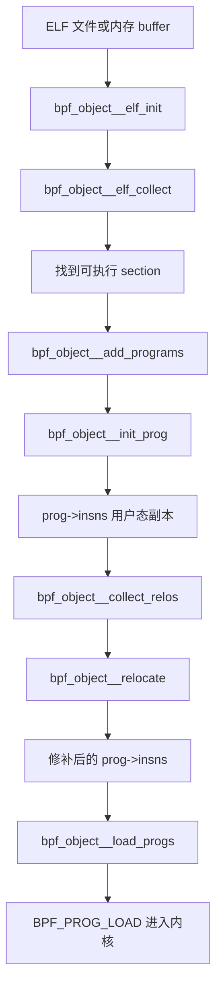
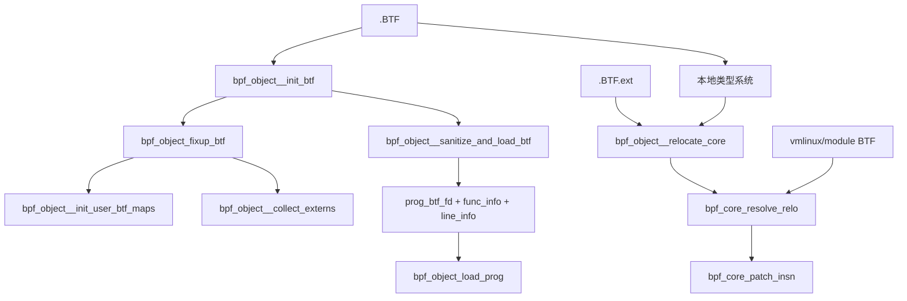

# libbpf 程序加载全流程深度分析

## 0. 分析范围与工具

- 目标源码：`src/libbpf.c`
- 重点入口：`bpf_object__open_file()`、`bpf_object__load()`
- 使用工具：
  - `clangd-lsp-client.py`：语义调用链/层次分析
  - `cscope`：批量 caller/callee 交叉校验
  - `readtags`：关键符号与行号定位
- 索引状态：`compile_commands.json` 存在；`ctags/cscope` 索引可用；clangd 背景索引文件数为 0，但 LSP 语义查询可直接工作。

---

## 1. 总览：libbpf 的两阶段加载模型

libbpf 把“程序加载”拆成两个大阶段：

1. **Open 阶段**：把 ELF/BTF/重定位/Map 定义读进用户态对象 `struct bpf_object`，但**还不向内核发起真正的 map/prog 创建**。
2. **Prepare/Load 阶段**：解析 extern、做 CO-RE 和普通重定位、创建 maps、上传 BTF、最后把程序通过 `BPF_PROG_LOAD` 送进内核。

### 1.1 顶层调用树

```text
bpf_object__open_file()                    [libbpf.c:8445]
  -> bpf_object_open()                    [libbpf.c:8339]
     -> bpf_object__elf_init()            [libbpf.c:1576]
     -> bpf_object__elf_collect()         [libbpf.c:3890]
     -> bpf_object__collect_externs()     [libbpf.c:4294]
     -> bpf_object_fixup_btf()            [libbpf.c:3506]
     -> bpf_object__init_maps()           [libbpf.c:3097]
     -> bpf_object_init_progs()           [libbpf.c:8306]
     -> bpf_object__collect_relos()       [libbpf.c:7674]

bpf_object__load()                        [libbpf.c:9040]
  -> bpf_object_load()                    [libbpf.c:8983]
     -> bpf_object_prepare()              [libbpf.c:8951]
        -> bpf_object_prepare_token()     [libbpf.c:5110]
        -> bpf_object__probe_loading()    [libbpf.c:5163]
        -> bpf_object__load_vmlinux_btf() [libbpf.c:3588]
        -> bpf_object__resolve_externs()  [libbpf.c:8768]
        -> bpf_object__sanitize_maps()    [libbpf.c:8492]
        -> bpf_object__init_kern_struct_ops_maps() [libbpf.c:1364]
        -> bpf_object_adjust_struct_ops_autoload() [libbpf.c:1124]
        -> bpf_object__relocate()         [libbpf.c:7418]
        -> bpf_object__sanitize_and_load_btf() [libbpf.c:3609]
        -> bpf_object__create_maps()      [libbpf.c:5595]
        -> bpf_object_prepare_progs()     [libbpf.c:8289]
     -> bpf_object__load_progs()          [libbpf.c:8258]
     -> bpf_object_init_prog_arrays()     [libbpf.c:5558]
     -> bpf_object_prepare_struct_ops()   [libbpf.c:8900]
```

### 1.2 关键代码片段

`bpf_object_open()` 直接把 Open 阶段串起来（`libbpf.c:8426-8432`）：

```c
err = bpf_object__elf_init(obj);
err = err ? : bpf_object__elf_collect(obj);
err = err ? : bpf_object__collect_externs(obj);
err = err ? : bpf_object_fixup_btf(obj);
err = err ? : bpf_object__init_maps(obj, opts);
err = err ? : bpf_object_init_progs(obj, opts);
err = err ? : bpf_object__collect_relos(obj);
```

`bpf_object_prepare()` 串起 Prepare 阶段（`libbpf.c:8960-8970`）：

```c
err = bpf_object_prepare_token(obj);
err = err ? : bpf_object__probe_loading(obj);
err = err ? : bpf_object__load_vmlinux_btf(obj, false);
err = err ? : bpf_object__resolve_externs(obj, obj->kconfig);
err = err ? : bpf_object__sanitize_maps(obj);
err = err ? : bpf_object__init_kern_struct_ops_maps(obj);
err = err ? : bpf_object_adjust_struct_ops_autoload(obj);
err = err ? : bpf_object__relocate(obj, obj->btf_custom_path ? : target_btf_path);
err = err ? : bpf_object__sanitize_and_load_btf(obj);
err = err ? : bpf_object__create_maps(obj);
err = err ? : bpf_object_prepare_progs(obj);
```

---

## 2. Open 阶段完整调用链

## 2.1 `bpf_object__open_file()`

- **位置**：`libbpf.c:8445`
- **签名**：`struct bpf_object *bpf_object__open_file(const char *path, const struct bpf_object_open_opts *opts)`
- **核心逻辑**：
  - 只做参数检查和 API 适配；
  - 真正工作由 `bpf_object_open()` 完成。
- **下层调用**：`libbpf_ptr()`、`bpf_object_open()`。

## 2.2 `bpf_object_open()`

- **位置**：`libbpf.c:8339`
- **签名**：`static struct bpf_object *bpf_object_open(const char *path, const void *obj_buf, size_t obj_buf_sz, const char *obj_name, const struct bpf_object_open_opts *opts)`
- **核心逻辑**：
  - 初始化 libelf；
  - 创建 `struct bpf_object`；
  - 保存 log/token/btf_custom_path/kconfig 等 open 选项；
  - 串行执行 ELF 解析、extern 收集、BTF 修补、map/program 初始化、重定位收集；
  - Open 阶段结束后调用 `bpf_object__elf_finish()` 释放 libelf 侧状态，但保留 libbpf 自己复制后的结果。
- **下层调用**：
  - `bpf_object__new()`
  - `bpf_object__elf_init()`
  - `bpf_object__elf_collect()`
  - `bpf_object__collect_externs()`
  - `bpf_object_fixup_btf()`
  - `bpf_object__init_maps()`
  - `bpf_object_init_progs()`
  - `bpf_object__collect_relos()`

## 2.3 `bpf_object__elf_init()`

- **位置**：`libbpf.c:1576`
- **签名**：`static int bpf_object__elf_init(struct bpf_object *obj)`
- **核心逻辑**：
  1. 如果来自内存缓冲区，走 `elf_memory()`；否则 `open()` + `elf_begin()`；
  2. 校验 `ELF_K_ELF`、`ELFCLASS64`；
  3. 读取 ELF Header，记录字节序 `obj->byteorder`；
  4. 获取 section name string table 索引 `shstrndx`；
  5. 校验目标文件必须是 `ET_REL`，`e_machine` 允许 `EM_BPF` 或旧 LLVM 的 `EM_NONE`。
- **它做了什么**：
  - 这一步只建立 **ELF 访问上下文**，还没有识别 program/map/BTF；
  - 同时把后续需要的 ELF 元信息（header、section name string table、endianness）准备好。
- **下层调用**：`elf_memory()`、`open()`、`elf_begin()`、`elf_kind()`、`gelf_getclass()`、`elf64_getehdr()`、`elf_getshdrstrndx()`、`elf_rawdata()`、`bpf_object__elf_finish()`。

## 2.4 `bpf_object__elf_collect()`

- **位置**：`libbpf.c:3890`
- **签名**：`static int bpf_object__elf_collect(struct bpf_object *obj)`
- **核心逻辑**：
  - **第一遍**扫描所有 section，先找到 `SHT_SYMTAB`，保存：
    - `obj->efile.symbols`
    - `obj->efile.symbols_shndx`
    - `obj->efile.strtabidx`
  - **第二遍**逐 section 分类：
    - `license` → `bpf_object__init_license()`
    - `version` → `bpf_object__init_kversion()`
    - `.maps` (`MAPS_ELF_SEC`) → 记下 `btf_maps_shndx`
    - `.BTF` / `.BTF.ext` → 暂存 `btf_data` / `btf_ext_data`
    - `SHF_EXECINSTR` 的 `SHT_PROGBITS` → `bpf_object__add_programs()`
    - `.data/.rodata/.bss` → 标记为内部全局数据 section
    - `struct_ops` 相关 section → 标记为 `SEC_ST_OPS`
    - `.arena` / `.jumptables` → 特殊保存
    - `SHT_REL` → 只接受对程序、`.maps`、`struct_ops` 的重定位 section，标记为 `SEC_RELO`
  - 如果 ELF 与主机字节序不同，调用 `bpf_object_bswap_progs()` 把 BPF 指令转换到本机字节序，便于后续用户态分析/修改；
  - 对 `obj->programs` 按 `(sec_idx, sec_insn_off)` 排序，便于按 section+指令偏移二分查找；
  - 最后 `bpf_object__init_btf()` 解析 `.BTF/.BTF.ext`。
- **如何识别 program/map/BTF**：
  - **program**：`SHT_PROGBITS && SHF_EXECINSTR && size>0`
  - **BTF maps**：section 名等于 `.maps`
  - **全局数据 maps 候选**：`.data/.rodata/.bss`
  - **BTF**：section 名 `.BTF`
  - **BTF.ext**：section 名 `.BTF.ext`
  - **重定位**：`SHT_REL` 且目标 section 是程序/`.maps`/`struct_ops`
- **下层调用**：`elf_getshdrnum()`、`elf_nextscn()`、`elf_sec_hdr()`、`elf_sec_data()`、`elf_sec_str()`、`bpf_object__init_license()`、`bpf_object__init_kversion()`、`bpf_object__add_programs()`、`bpf_object_bswap_progs()`、`qsort()`、`bpf_object__init_btf()`。

### 2.4.1 ELF 指令如何变成 `bpf_insn[]`

这条数据流最关键的两个函数是：

1. `bpf_object__add_programs()`（`libbpf.c:900`）
2. `bpf_object__init_prog()`（`libbpf.c:839`）

`bpf_object__add_programs()` 的职责：
- 遍历 symbol table，筛选 `st_shndx == 当前代码段 && STT_FUNC`；
- 用 `st_value/st_size` 切出该函数在 section 中的指令窗口；
- 为每个符号分配一个 `struct bpf_program`；
- 调用 `bpf_object__init_prog()` 复制原始指令。

`bpf_object__init_prog()` 的职责：
- 校验 `insn_data_sz` 和 `sec_off` 必须按 `BPF_INSN_SZ(=8)` 对齐；
- 记录：
  - `prog->sec_idx`
  - `prog->sec_insn_off`
  - `prog->sec_insn_cnt`
  - `prog->insns_cnt`
- 复制一份 section 中该函数对应的机器码到 `prog->insns`。

因此：

```text
ELF section(.text/tracepoint/...)
  -> symbol table(STT_FUNC, st_value, st_size)
  -> bpf_object__add_programs()
  -> bpf_object__init_prog()
  -> prog->insns (用户态可修改的 bpf_insn 数组)
```

## 2.5 `bpf_object__collect_externs()`

- **位置**：`libbpf.c:4294`
- **签名**：`static int bpf_object__collect_externs(struct bpf_object *obj)`
- **核心逻辑**：
  1. 遍历 ELF 符号表，筛选 `SHN_UNDEF + STT_NOTYPE + GLOBAL/WEAK` 的 extern 符号；
  2. 通过 `find_extern_btf_id()` 在本地 BTF 中找到 extern 对应的 `BTF_KIND_VAR/BTF_KIND_FUNC`；
  3. 通过 `find_extern_sec_btf_id()` 再找到 extern 所属的 BTF DATASEC；
  4. 识别 extern 属于：
     - `.kconfig` → `EXT_KCFG`
     - `.ksyms` → `EXT_KSYM`
  5. 对 `EXT_KCFG` 计算类型、大小、对齐和未来在 `.kconfig` map 中的偏移；
  6. 对 `EXT_KSYM` 记录其本地 BTF 类型 ID，供后续与内核 BTF 匹配；
  7. 修改本地 BTF：
     - `.ksyms` extern 伪装成已分配全局变量，满足 verifier/BTF 校验；
     - `.kconfig` extern 的 DATASEC offset 也被提前写好。
- **本质**：
  - Open 阶段只是把 extern 从“未解析符号”转成 `struct extern_desc[]`；
  - 真正值解析在 Prepare 阶段的 `bpf_object__resolve_externs()` 里完成。
- **下层调用**：
  - `sym_is_extern()`
  - `find_extern_btf_id()`
  - `find_extern_sec_btf_id()`
  - `find_kcfg_type()`
  - `bpf_core_essential_name_len()`
  - `add_dummy_ksym_var()`
  - `qsort()`

## 2.6 `bpf_object__init_maps()`

- **位置**：`libbpf.c:3097`
- **签名**：`static int bpf_object__init_maps(struct bpf_object *obj, const struct bpf_object_open_opts *opts)`
- **核心逻辑**：
  - 只是一个总调度器，依次做：
    1. `bpf_object__init_user_btf_maps()`
    2. `bpf_object__init_global_data_maps()`
    3. `bpf_object__init_kconfig_map()`
    4. `bpf_object_init_struct_ops()`

### 2.6.1 `bpf_object__init_user_btf_maps()`：BTF map 初始化

- **位置**：`libbpf.c:3018`
- **签名**：`static int bpf_object__init_user_btf_maps(struct bpf_object *obj, bool strict, const char *pin_root_path)`
- **核心逻辑**：
  - 在本地 BTF 中找到名字为 `.maps` 的 DATASEC；
  - 对 DATASEC 中每个 `VAR` 调 `bpf_object__init_user_btf_map()`；
  - 每个 map 再由 `parse_btf_map_def()` 解析结构体字段：`type/max_entries/key/value/pinning/map_extra/values(inner map or prog array)`；
  - 解析结果由 `fill_map_from_def()` 回填到 `struct bpf_map`；
  - `map_fill_btf_type_info()` 补齐 key/value BTF type id；
  - 特判 `ARENA` map，并把 `.arena` section 数据挂到该 map。
- **下层调用**：`elf_sec_by_idx()`、`elf_sec_data()`、`bpf_object__init_user_btf_map()`、`parse_btf_map_def()`、`fill_map_from_def()`、`map_fill_btf_type_info()`、`init_arena_map_data()`。

### 2.6.2 `bpf_object__init_global_data_maps()`：全局变量初始化成内部 map

- **位置**：`libbpf.c:2016`
- **签名**：`static int bpf_object__init_global_data_maps(struct bpf_object *obj)`
- **核心逻辑**：
  - 扫描 `elf_collect()` 标记过的 section；
  - 将：
    - `SEC_DATA` → `LIBBPF_MAP_DATA`
    - `SEC_RODATA` → `LIBBPF_MAP_RODATA`
    - `SEC_BSS` → `LIBBPF_MAP_BSS`
  - 统一转成 libbpf 内部 array map（经 `bpf_object__init_internal_map()` 建模）；
  - `.rodata` 会额外标记 `obj->has_rodata=true`。
- **意义**：
  - BPF C 里的全局变量并不是直接“塞进程序”，而是先变成 map，再通过重定位把指令改成 map value 访问。

### 2.6.3 `bpf_object__init_kconfig_map()`

- **位置**：`libbpf.c:2371`
- **签名**：`static int bpf_object__init_kconfig_map(struct bpf_object *obj)`
- **核心逻辑**：
  - 如果存在 `EXT_KCFG` extern，就创建一个内部 `.kconfig` map；
  - map 大小取最后一个 kcfg extern 的 `data_off + size`。

## 2.7 `bpf_object_init_progs()`

- **位置**：`libbpf.c:8306`
- **签名**：`static int bpf_object_init_progs(struct bpf_object *obj, const struct bpf_object_open_opts *opts)`
- **核心逻辑**：
  - 对每个 `struct bpf_program`，调用 `find_sec_def(prog->sec_name)`；
  - 从 `section_defs[]` 推断：
    - `prog->type`
    - `prog->expected_attach_type`
  - 如果该 section 定义有 `prog_setup_fn`，继续做特化初始化。
- **下层调用**：`find_sec_def()`、`prog_setup_fn`（可选）。

## 2.8 `bpf_object__collect_relos()`

- **位置**：`libbpf.c:7674`
- **签名**：`static int bpf_object__collect_relos(struct bpf_object *obj)`
- **核心逻辑**：
  - 遍历所有 `SEC_RELO` section；
  - 依据其目标 section 分发到：
    - `bpf_object__collect_st_ops_relos()`
    - `bpf_object__collect_map_relos()`
    - `bpf_object__collect_prog_relos()`
  - 完成后 `bpf_object__sort_relos()` 按 `insn_idx` 排序。
- **下层调用**：`bpf_object__collect_st_ops_relos()`、`bpf_object__collect_map_relos()`、`bpf_object__collect_prog_relos()`、`bpf_object__sort_relos()`。

### 2.8.1 `bpf_object__collect_prog_relos()`：程序重定位收集

- **位置**：`libbpf.c:4827`
- **签名**：`static int bpf_object__collect_prog_relos(struct bpf_object *obj, Elf64_Shdr *shdr, Elf_Data *data)`
- **核心逻辑**：
  - 遍历 `.rel<prog section>` 中的每条 `Elf64_Rel`；
  - 计算 `insn_idx = r_offset / 8`；
  - 用 `find_prog_by_sec_insn()` 把“section 内偏移”映射到具体 `struct bpf_program`；
  - 调 `bpf_program__record_reloc()` 归类重定位类型。

### 2.8.2 `bpf_program__record_reloc()`：把 ELF relo 转成 libbpf 内部描述

- **位置**：`libbpf.c:4610`
- **签名**：`static int bpf_program__record_reloc(struct bpf_program *prog, struct reloc_desc *reloc_desc, __u32 insn_idx, const char *sym_name, const Elf64_Sym *sym, const Elf64_Rel *rel)`
- **可产生的关键重定位类型**：
  - `RELO_EXTERN_CALL`
  - `RELO_EXTERN_LD64`
  - `RELO_CALL`
  - `RELO_SUBPROG_ADDR`
  - `RELO_LD64`
  - `RELO_DATA`
  - `RELO_INSN_ARRAY`
- **意义**：
  - 从这一刻起，libbpf 不再关心 ELF relocation 语法，而是只操作统一的 `struct reloc_desc`。

---

## 3. Prepare / Load 阶段完整调用链

## 3.1 `bpf_object__load_vmlinux_btf()`

- **位置**：`libbpf.c:3588`
- **签名**：`static int bpf_object__load_vmlinux_btf(struct bpf_object *obj, bool force)`
- **核心逻辑**：
  - 若已经加载过 `obj->btf_vmlinux`，直接返回；
  - 若 `force=false` 且 `obj_needs_vmlinux_btf(obj)` 判断不需要，则跳过；
  - 否则调用 `btf__load_vmlinux_btf()` 加载内核 BTF。
- **什么时候需要**：
  - 有 CO-RE relocation；
  - 有 typed ksym；
  - tracing/lsm/struct_ops 等依赖内核 BTF 的 program/map。
- **下层调用**：`obj_needs_vmlinux_btf()`、`btf__load_vmlinux_btf()`。

## 3.2 `bpf_object__resolve_externs()`

- **位置**：`libbpf.c:8768`
- **签名**：`static int bpf_object__resolve_externs(struct bpf_object *obj, const char *extra_kconfig)`
- **核心逻辑**：
  1. 遍历 `obj->externs[]`；
  2. 对 `EXT_KCFG`：
     - `LINUX_KERNEL_VERSION` / `LINUX_HAS_*` 由 libbpf 直接填写；
     - `CONFIG_*` 需要从 `extra_kconfig` 或 `/boot/config-*` / `/proc/config.gz` 读取；
  3. 对 `EXT_KSYM`：
     - 无类型 ksym：从 `/proc/kallsyms` 取地址；
     - typed ksym/kfunc：调用 `bpf_object__resolve_ksyms_btf_id()`，用 vmlinux/module BTF 做名字+类型兼容性匹配；
  4. 强符号必须全部解析成功；弱符号允许保持 0。
- **下层调用**：
  - `bpf_object__read_kconfig_mem()`
  - `bpf_object__read_kconfig_file()`
  - `bpf_object__read_kallsyms_file()`
  - `bpf_object__resolve_ksyms_btf_id()`
  - `set_kcfg_value_num()`

### 3.2.1 `bpf_object__resolve_ksyms_btf_id()`

- **位置**：`libbpf.c:8740`
- **签名**：`static int bpf_object__resolve_ksyms_btf_id(struct bpf_object *obj)`
- **核心逻辑**：
  - typed extern variable → `bpf_object__resolve_ksym_var_btf_id()`；
  - typed extern function/kfunc → `bpf_object__resolve_ksym_func_btf_id()`；
  - 用 `bpf_core_types_are_compat()` 确认本地 BTF 与内核 BTF 类型兼容；
  - 成功后把 `kernel_btf_id/kernel_btf_obj_fd/btf_fd_idx` 写回 extern 描述。

## 3.3 `bpf_object__relocate()`

- **位置**：`libbpf.c:7418`
- **签名**：`static int bpf_object__relocate(struct bpf_object *obj, const char *targ_btf_path)`
- **核心逻辑**：
  1. 若存在 `.BTF.ext` CO-RE 信息，先执行 `bpf_object__relocate_core()`；
  2. 对 arena map 计算 `arena_data_off`；
  3. 先把 `RELO_SUBPROG_ADDR` 对应的 `ldimm64` 标记成 `BPF_PSEUDO_FUNC`；
  4. 对每个 entry program：
     - `bpf_object__relocate_calls()`：递归拼接并重写 subprog 调用；
     - `bpf_prog_assign_exc_cb()`：处理 exception callback；
  5. 再对每个 entry program：
     - `bpf_object__relocate_data()`：修 map/global data/extern/kfunc/jumptable；
     - `bpf_program_fixup_func_info()`：修复 `.BTF.ext` 中 func/line info 的偏移。
- **下层调用**：
  - `bpf_object__relocate_core()`
  - `bpf_object__sort_relos()`
  - `bpf_object__relocate_calls()`
  - `bpf_prog_assign_exc_cb()`
  - `bpf_object__append_subprog_code()`
  - `bpf_object__reloc_code()`
  - `bpf_object__relocate_data()`
  - `bpf_program_fixup_func_info()`

### 3.3.1 `bpf_object__relocate_core()`：CO-RE 总入口

- **位置**：`libbpf.c:6073`
- **签名**：`static int bpf_object__relocate_core(struct bpf_object *obj, const char *targ_btf_path)`
- **核心逻辑**：
  - 遍历 `.BTF.ext` 的 `core_relo_info`；
  - 用 `find_prog_by_sec_insn()` 找到 relocation 属于哪个 program；
  - 先 `record_relo_core()` 记录成 `RELO_CORE`；
  - 再调用：
    - `bpf_core_resolve_relo()`：基于本地 BTF + 目标 BTF 计算 relocation 结果；
    - `bpf_core_patch_insn()`：直接改写对应 `bpf_insn`。
- **要点**：
  - CO-RE 在 **程序真正 load 之前** 就已经把指令改好了；
  - 目标 BTF 可以是默认 vmlinux，也可以是 `btf_custom_path` 指定路径。

### 3.3.2 `bpf_object__relocate_calls()` / `bpf_object__reloc_code()`：subprog 调用重定位

- **位置**：
  - `bpf_object__relocate_calls()`：`libbpf.c:6951`
  - `bpf_object__reloc_code()`：`libbpf.c:6761`
- **签名**：
  - `static int bpf_object__relocate_calls(struct bpf_object *obj, struct bpf_program *prog)`
  - `static int bpf_object__reloc_code(struct bpf_object *obj, struct bpf_program *main_prog, struct bpf_program *prog)`
- **核心逻辑**：
  - 把 `.text` 里的 subprog 当成“可复用代码片段”；
  - 对每个主程序，递归找到它实际用到的 subprog；
  - 用 `bpf_object__append_subprog_code()` 把这些 subprog 追加到主程序末尾；
  - 再把原始 `call imm` 改成“相对当前最终布局”的新偏移。
- **本质**：
  - ELF 层面是分散函数；
  - verifier/load 层面，每个 entry program 最终都变成一个**自包含的大指令数组**。

### 3.3.3 `bpf_object__relocate_data()`：map/global/extern 重定位

- **位置**：`libbpf.c:6402`
- **签名**：`static int bpf_object__relocate_data(struct bpf_object *obj, struct bpf_program *prog)`
- **核心逻辑**：
  - `RELO_LD64`：把 `ldimm64` 改成加载 map fd / map idx；
  - `RELO_DATA`：把 `ldimm64` 改成 `BPF_PSEUDO_MAP_VALUE`，并把第二条指令的 `imm` 写成变量偏移；
  - `RELO_EXTERN_LD64`：
    - `EXT_KCFG` → 指向 `.kconfig` map value；
    - `EXT_KSYM` → typed ksym 用 `BPF_PSEUDO_BTF_ID`，typeless ksym 直接写绝对地址；
  - `RELO_EXTERN_CALL`：改成 `BPF_PSEUDO_KFUNC_CALL`；
  - `RELO_INSN_ARRAY`：为 jump table 创建 `BPF_MAP_TYPE_INSN_ARRAY` map；
  - 未解析但允许延迟失败的 map/kfunc，会被 “poison” 成 identifiable invalid call，便于 verifier 日志增强。

### 3.3.4 重定位如何修改指令

```text
原始 ldimm64 指令
  -> collect_relos 阶段变成 reloc_desc
  -> relocate_data / relocate_core / relocate_calls
  -> 直接修改 prog->insns[]
  -> load_progs 时送入内核的是“已修补完成”的指令
```

典型改写：
- **全局变量**：`ldimm64 map_sym` → `BPF_PSEUDO_MAP_VALUE + fd + data_off`
- **普通 map**：`ldimm64 map_sym` → `BPF_PSEUDO_MAP_FD + fd`
- **kfunc**：`call extern` → `BPF_PSEUDO_KFUNC_CALL + kernel_btf_id`
- **subprog call**：`call imm` → 按最终拼接布局重算 `imm`
- **CO-RE**：字段偏移/类型 ID/枚举值等被 `bpf_core_patch_insn()` 改写到立即数或访问偏移

## 3.4 `bpf_object__create_maps()`

- **位置**：`libbpf.c:5595`
- **签名**：`static int bpf_object__create_maps(struct bpf_object *obj)`
- **核心逻辑**：
  - 遍历 `obj->maps[]`；
  - 对旧内核若不支持全局数据，内部 map 可能被禁用 autocreate；
  - 支持 pinned map 复用：`bpf_object__reuse_map()`；
  - 否则通过 `bpf_object__create_map()` 真正 `BPF_MAP_CREATE`；
  - 内部 map 创建后调用 `bpf_object__populate_internal_map()` 写入初值；
  - map-in-map 会通过 `init_map_in_map_slots()` 继续填充 slot；
  - 若配置 pinning，则自动 pin 到 bpffs。
- **下层调用**：`map_set_def_max_entries()`、`bpf_object__reuse_map()`、`bpf_object__create_map()`、`bpf_object__populate_internal_map()`、`init_map_in_map_slots()`、`bpf_map__pin()`。

### 3.4.1 `bpf_object__create_map()`

- **位置**：`libbpf.c:5353`
- **签名**：`static int bpf_object__create_map(struct bpf_object *obj, struct bpf_map *map, bool is_inner)`
- **核心逻辑**：
  - 组织 `bpf_map_create_opts`；
  - 若对象 BTF 已上传，把 `btf_fd/btf_key_type_id/btf_value_type_id` 一并带给内核；
  - map-in-map 先递归创建 inner map；
  - 某些 map 类型会主动清空 BTF type id（内核不接受）；
  - 真正调用 `bpf_map_create()`；
  - 如果因 BTF type id 创建失败，会自动“去掉 BTF 再试一次”；
  - 最终用 `reuse_fd()` 让 placeholder fd 保持稳定。

## 3.5 `bpf_object__load_progs()`

- **位置**：`libbpf.c:8258`
- **签名**：`static int bpf_object__load_progs(struct bpf_object *obj, int log_level)`
- **核心逻辑**：
  - 只加载 entry program，跳过 subprog；
  - 跳过 `autoload=false` 的程序；
  - 调 `bpf_object_load_prog()` 发起 `BPF_PROG_LOAD`；
  - 全部成功后释放 relocation 描述符。
- **下层调用**：`bpf_program_record_relos()`（gen_loader 模式）、`bpf_object_load_prog()`、`bpf_object__free_relocs()`。

### 3.5.1 `bpf_object_load_prog()`

- **位置**：`libbpf.c:7829`
- **签名**：`static int bpf_object_load_prog(struct bpf_object *obj, struct bpf_program *prog, struct bpf_insn *insns, int insns_cnt, const char *license, __u32 kern_version, int *prog_fd)`
- **核心逻辑**：
  - 组装 `bpf_prog_load_opts`；
  - 若 BTF 已上传且内核支持 func/line info，则把 `prog_btf_fd/func_info/line_info` 一并提交；
  - 若 section 类型定义了 `prog_prepare_load_fn`（典型是 tracing/lsm/fentry/freplace），就在这里补齐 attach BTF 信息；
  - 首次失败时自动提升 log_level 并重试；若日志缓冲区不足，还会扩大再试；
  - 成功后，如内核支持，还会把 rodata map 通过 `bpf_prog_bind_map()` 绑定到程序。

---

## 4. Section 命名约定与程序类型映射

## 4.1 `section_defs[]`

- **位置**：`libbpf.c:9978`
- **类型**：`static const struct bpf_sec_def section_defs[]`
- **作用**：把 **ELF section name** 映射为：
  - `enum bpf_prog_type`
  - `enum bpf_attach_type`
  - 可选 `prog_setup_fn`
  - 可选 `prog_prepare_load_fn`
  - 可选 `prog_attach_fn`
  - 标志位（如 `SEC_ATTACH_BTF`、`SEC_SLEEPABLE`、`SEC_XDP_FRAGS`）

## 4.2 匹配规则：`sec_def_matches()` / `find_sec_def()`

- **位置**：
  - `sec_def_matches()`：`libbpf.c:10175`
  - `find_sec_def()`：`libbpf.c:10203`
- **规则**：
  - **精确匹配**：如 `xdp`
  - **以 `/` 结尾**：必须是 `type/...` 形式
  - **以 `+` 结尾**：既允许精确 `type`，也允许 `type/...`
- **优先级**：
  1. 自定义 handler
  2. 内建 `section_defs[]`
  3. 自定义 fallback handler

## 4.3 代表性映射

| section 前缀 | prog_type | expected_attach_type | 备注 |
|---|---|---|---|
| `kprobe+` / `uprobe+` | `BPF_PROG_TYPE_KPROBE` | 0 | 运行时 attach 到符号/地址 |
| `tracepoint+` / `tp+` | `BPF_PROG_TYPE_TRACEPOINT` | 0 | 传统 tracepoint |
| `raw_tracepoint+` | `BPF_PROG_TYPE_RAW_TRACEPOINT` | 0 | 原始 tracepoint |
| `fentry+` / `fexit+` / `fmod_ret+` | `BPF_PROG_TYPE_TRACING` | 对应 tracing attach type | 依赖 BTF attach target |
| `lsm+` | `BPF_PROG_TYPE_LSM` | `BPF_LSM_MAC` | 依赖 BTF |
| `iter+` | `BPF_PROG_TYPE_TRACING` | `BPF_TRACE_ITER` | 依赖 BTF |
| `xdp` / `xdp.frags` | `BPF_PROG_TYPE_XDP` | `BPF_XDP` 等 | `xdp.frags` 会加 `BPF_F_XDP_HAS_FRAGS` |
| `tcx/ingress` / `tcx/egress` | `BPF_PROG_TYPE_SCHED_CLS` | 对应 TCX attach type | `tc/*` 是兼容别名 |
| `cgroup/...` | 各类 `CGROUP_*` 程序类型 | 对应 cgroup attach type | section 名里直接编码 attach 语义 |
| `struct_ops+` | `BPF_PROG_TYPE_STRUCT_OPS` | 0 | 与 struct_ops map 联动 |
| `syscall` | `BPF_PROG_TYPE_SYSCALL` | 0 | 默认 sleepable |
| `netfilter` | `BPF_PROG_TYPE_NETFILTER` | `BPF_NETFILTER` | netfilter 专用 |

## 4.4 BTF attach 型 section 的额外处理

对 `fentry/fexit/fmod_ret/freplace/lsm/iter/tp_btf` 这类 section，`section_defs[]` 通常带 `SEC_ATTACH_BTF`；其 load 前还会经过 `libbpf_prepare_prog_load()`（`libbpf.c:7762`）：

- 若 section 名写成 `fentry/do_sys_open`，则从 `/` 后面提取 attach target；
- 通过 `libbpf_find_attach_btf_id()` 把目标函数/类型解析成 `attach_btf_obj_fd + attach_btf_id`；
- 再写入 `bpf_prog_load_opts`。

---

## 5. 关键数据流

## 5.1 从 ELF 字节流到 `bpf_insn[]`



## 5.2 从 BTF 到 map/prog/CO-RE 的关联



## 5.3 重定位分类总表

| 重定位类型 | 收集位置 | 执行位置 | 作用 |
|---|---|---|---|
| `RELO_CALL` | `bpf_program__record_reloc()` | `bpf_object__relocate_calls()` | 子程序调用偏移修正 |
| `RELO_SUBPROG_ADDR` | 同上 | `bpf_object__relocate()`/`bpf_object__reloc_code()` | 函数地址 ldimm64 修正 |
| `RELO_LD64` | 同上 | `bpf_object__relocate_data()` | map fd/idx 注入 |
| `RELO_DATA` | 同上 | `bpf_object__relocate_data()` | 全局变量/内部 map value 偏移注入 |
| `RELO_EXTERN_LD64` | 同上 | `bpf_object__relocate_data()` | kcfg/ksym 地址或 BTF ID 注入 |
| `RELO_EXTERN_CALL` | 同上 | `bpf_object__relocate_data()` | kfunc 调用修正 |
| `RELO_CORE` | `record_relo_core()` | `bpf_object__relocate_core()` | CO-RE 类型/字段/枚举适配 |
| `RELO_INSN_ARRAY` | `bpf_program__record_reloc()` | `bpf_object__relocate_data()` | jump table map 化 |

## 5.4 BTF 信息如何关联到程序

1. `.BTF` 被解析成 `obj->btf`；
2. `.BTF.ext` 保存每个 section 的 func info / line info / core relo info；
3. `bpf_object__relocate_calls()` 在拼接 subprog 后，会通过 `reloc_prog_func_and_line_info()`/`adjust_prog_btf_ext_info()` 重写 `.BTF.ext` 的 instruction offset；
4. `bpf_object__sanitize_and_load_btf()` 把 BTF 上传到内核，得到 `btf_fd`；
5. `bpf_object_load_prog()` 把 `prog_btf_fd + func_info + line_info` 提交给 `BPF_PROG_LOAD`；
6. tracing/lsm/fentry 等还会额外带 `attach_btf_id`，用于声明 attach target。

---

## 6. 分阶段总结

## 6.1 Open 阶段的本质

Open 阶段做的不是“加载到内核”，而是把 ELF 对象编译成 libbpf 自己的中间表示：

- `struct bpf_program[]`
- `struct bpf_map[]`
- `struct extern_desc[]`
- `struct reloc_desc[]`
- `obj->btf / obj->btf_ext`

这一步结束后，libbpf 已经知道：
- 有哪些程序；
- 它们属于什么 section；
- section 名意味着什么 prog_type；
- 有哪些 map；
- 有哪些 extern；
- 每条重定位应该改哪条指令。

## 6.2 Prepare/Load 阶段的本质

Prepare/Load 阶段做的是“把中间表示变成内核可接受对象”：

- extern 从“声明”变成“真实值/真实 BTF ID”；
- CO-RE 从“抽象类型差异”变成“具体指令补丁”；
- subprog 从“独立函数”变成“每个 entry prog 自带代码块”；
- 全局变量从“ELF data section”变成“内部 map value 访问”；
- 本地 BTF/.BTF.ext 从“编译器产物”变成“内核可消费元信息”；
- 最终调用 `bpf_map_create()` 和 `bpf_prog_load()` 完成真正加载。

---

## 7. 最关键的结论

1. **`bpf_object__open_file()` 不是内核加载入口，而是用户态解析入口。**
2. **ELF section 中的原始字节码会被复制成 `prog->insns[]`，之后所有重定位都直接修改这份副本。**
3. **全局变量并不会“嵌入程序”，而是被建模成内部 map，再通过 `RELO_DATA` 改写成 map value 访问。**
4. **CO-RE 的真正入口是 `bpf_object__relocate_core()`；它消费 `.BTF.ext` 的 core relocation 记录，并基于目标 BTF 直接 patch 指令。**
5. **subprog 调用不是简单保留原 ELF 布局，而是按每个 entry program 的实际依赖重新拼接代码并重算 call offset。**
6. **section name 是 program type/attach type 推断的核心输入；`section_defs[]` 是 libbpf “语义识别表”。**
7. **程序最终送入内核前，指令、BTF、func_info、line_info、attach target 都已经在用户态准备完毕。**

---

## 8. 关键函数索引（便于继续阅读源码）

| 函数 | 位置 |
|---|---|
| `bpf_object__elf_init` | `libbpf.c:1576` |
| `bpf_object__elf_collect` | `libbpf.c:3890` |
| `bpf_object__collect_externs` | `libbpf.c:4294` |
| `bpf_object__init_maps` | `libbpf.c:3097` |
| `bpf_object__init_user_btf_maps` | `libbpf.c:3018` |
| `bpf_object__init_global_data_maps` | `libbpf.c:2016` |
| `bpf_object_init_progs` | `libbpf.c:8306` |
| `bpf_object__collect_relos` | `libbpf.c:7674` |
| `bpf_object__collect_prog_relos` | `libbpf.c:4827` |
| `bpf_program__record_reloc` | `libbpf.c:4610` |
| `bpf_object__load_vmlinux_btf` | `libbpf.c:3588` |
| `bpf_object__resolve_externs` | `libbpf.c:8768` |
| `bpf_object__resolve_ksyms_btf_id` | `libbpf.c:8740` |
| `bpf_object__relocate_core` | `libbpf.c:6073` |
| `bpf_object__relocate_calls` | `libbpf.c:6951` |
| `bpf_object__relocate_data` | `libbpf.c:6402` |
| `bpf_object__relocate` | `libbpf.c:7418` |
| `bpf_object__create_map` | `libbpf.c:5353` |
| `bpf_object__create_maps` | `libbpf.c:5595` |
| `bpf_object_load_prog` | `libbpf.c:7829` |
| `bpf_object__load_progs` | `libbpf.c:8258` |
| `section_defs[]` | `libbpf.c:9978` |
| `sec_def_matches` | `libbpf.c:10175` |
| `find_sec_def` | `libbpf.c:10203` |
